# STATS 201 Project: Life Expectancy Modeling, Robustness, and 2030 Projections

This project builds a reproducible country-year machine learning pipeline to predict life expectancy, evaluate modeling choices on future years, test reviewer-driven alternative specifications, and extend predictions to 2030 under scenario assumptions.

## 1) Research Question
Which socioeconomic and health-system indicators most strongly predict national life expectancy, and which modeling/feature-engineering choices generalize best to unseen future years?

## 2) Executive Summary
- Final selected model: `Random Forest (n_estimators=300, max_depth=15)`
- Final selected feature representation: `log_enhanced`
- Validation protocol: strict temporal holdout
  - Train: `2000-2017` (`n=3456` country-years)
  - Test: `2018-2021` (`n=768` country-years)
- Final test metrics:
  - `R² = 0.9885`
  - `RMSE = 0.7541` years
  - `MAE = 0.5217` years
- Generalization gap (`Train_R² - Test_R²`): `0.0112`
- Final-model decision rule from notebook: stop when marginal gain is negligible and robustness remains high (`min temporal R² >= 0.9`, `R² gap <= 0.03`).

Primary exported evidence:
- `Assets/cleaner_exports/project_final_summary.csv`
- `Assets/cleaner_exports/model_comparison_temporal.csv`
- `Assets/cleaner_exports/final_model_justification_temporal.txt`

## 3) Data Sources and Coverage
Raw files are in `Assets/full_data/` and include mortality, immunization, nutrition, alcohol, health-expenditure, and GDP/population indicators.

### Coverage after cleaning
- Raw panel: `4532` rows, `206` countries, `14` input features
- Clean panel: `4224` rows, `192` countries
- Features retained: `13`
- Dropped feature: `hiv_prev_15_49_pct`
- Dropped countries: `14` very low-coverage entities (from `dropped_countries.csv`)

Sources:
- `Assets/cleaner_exports/health_panel_dropped_summary.csv`
- `Assets/cleaner_exports/dropped_features.csv`
- `Assets/cleaner_exports/dropped_countries.csv`

## 4) Methodology and Key Choices

### A. Data cleaning choice (from `Codes/data_cleaning.ipynb`)
Why these thresholds were used:
- Drop features with missingness `> 40%`: remove highly incomplete signals likely to add noise.
- Drop countries with completeness `< 60%`: avoid unstable country series.
- Impute remaining gaps via country-wise interpolation + year-median fallback: preserve temporal continuity while minimizing data loss.

### B. Validation choice
Why a temporal split (not random split):
- Objective is future-year prediction.
- Random splits would leak near-future structure into training.
- Temporal holdout (`2000-2017` -> `2018-2021`) better reflects real deployment.

### C. Feature-engineering choice
Representations compared in training:
- `baseline`
- `log_enhanced`
- `polynomial`

Interpretation of results:
- Some models benefited from polynomial expansion, but the strongest overall future-year performance came from `Random Forest + log_enhanced`.
- Model choice was not made by a single metric only; RMSE/MAE and generalization gap were also checked.

### D. Model families compared
- Baselines: `DummyRegressor`, `LinearRegression`, `DecisionTreeRegressor`
- Advanced: `RandomForest`, `GradientBoosting`, `Ridge`, `Lasso`

## 5) Core Model Results
Top highlights from `model_comparison_temporal.csv`:

| Model + Feature Set | Test R² | Test RMSE | Test MAE |
|---|---:|---:|---:|
| Random Forest + log_enhanced | 0.9885 | 0.7541 | 0.5217 |
| Random Forest + baseline | 0.9885 | 0.7550 | 0.5227 |
| Gradient Boosting + polynomial | 0.9849 | 0.8634 | 0.6337 |
| Decision Tree + baseline | 0.9770 | 1.0650 | 0.7773 |

### Why the final combination was frozen
From `final_model_justification_temporal.txt`:
- Runner-up gain in test R² was negligible (`~2.56e-05`)
- R² gap remained low
- Temporal sensitivity remained strong
- Decision in notebook: stop adding complexity and freeze model

## 6) Robustness and Diagnostics
From `robustness_checks_temporal.csv` and diagnostics exports:

### Temporal sensitivity (alternative cutoffs)
- Test R² remained around `0.9884-0.9887` across multiple temporal cutoffs.

### Feature-group ablation
- Removing mortality indicators produced the largest performance drop (`R² drop ~0.1404`), confirming dominant predictive signal from mortality burden variables.

### Prediction stability by test year
- R² by year: `2018: 0.9956`, `2019: 0.9921`, `2020: 0.9855`, `2021: 0.9797`
- Error rose in later years, consistent with greater distribution shift near 2020-2021.

### Residual diagnostics
- Breusch-Pagan p-value indicates heteroscedasticity signal.
- Durbin-Watson around `1.67` indicates some residual autocorrelation.
- No high-influence points under the notebook Cook's D threshold.

## 7) What the Model Learned (Feature Importance)
From `feature_importance_analysis_temporal.csv` (Random Forest, final setup):
- `adult_mortality_15_60`: `88.09%`
- `u5_mortality_rate`: `10.45%`
- Remaining predictors contribute smaller but non-zero signal (GDP, nutrition, alcohol, health spending, immunization).

Interpretation choice made in project:
- Findings are explicitly treated as predictive associations, not causal effect sizes.

## 8) Projection Extension (2022-2030)
`Codes/projection.ipynb` extends the final model with country-wise feature extrapolation.

### Projection design choices
- Refit best model on the established training setup.
- Extrapolate each predictor using linear trend over `2015-2021`.
- Build three scenarios:
  - `baseline`
  - `optimistic`
  - `pessimistic`
- Quantify uncertainty using tree-level variation (80% interval).

### Important interpretation constraint
This is predictive extrapolation under trend continuity assumptions, not a causal or structural forecast.

## 9) Reviewer-Response Notebooks

### A. No-mortality specification (`Codes/non_mortality.ipynb`)
Purpose:
- Address tautology/bias concerns by excluding direct mortality/death variables:
  - `adult_mortality_15_60`
  - `u5_mortality_rate`
  - `infant_deaths`
  - `log_infant_deaths`

Best no-mortality result:
- Model: `Random Forest (300,15)`
- Feature set: `polynomial_no_mortality`
- Test metrics: `R² = 0.8766`, `RMSE = 2.4682`, `MAE = 1.7002`

Meaning:
- Predictive quality decreases substantially versus the core model, but non-mortality indicators still retain useful signal.

### B. Disease/conflict and shock proxies (`Codes/disease_and_conflict.ipynb`)
Purpose:
- Add scenario-style proxies for conflict/pandemic disruptions:
  - `conflict_shock_proxy`
  - `post_conflict_5y_proxy`
  - `covid_era_dummy`
  - `pandemic_stress_proxy`

Best augmented result:
- Model: `Random Forest (300,15)`
- Test metrics: `R² = 0.9884`, `RMSE = 0.7556`

Stress test result:
- Mean predicted life expectancy change under pandemic stress scenario vs baseline test period: `-0.023` years.

## 10) Notebook Execution Order (Reproducibility)
1. `Codes/export.ipynb`
2. `Codes/data_cleaning.ipynb`
3. `Codes/exploratory_analysis.ipynb`
4. `Codes/train_models.ipynb`
5. `Codes/project_final.ipynb`
6. `Codes/projection.ipynb`
7. `Codes/non_mortality.ipynb`
8. `Codes/disease_and_conflict.ipynb`

## 11) Figures
If images do not display in your viewer, open this file as rendered Markdown (or on GitHub), not as plain text.

### Exploratory Analysis
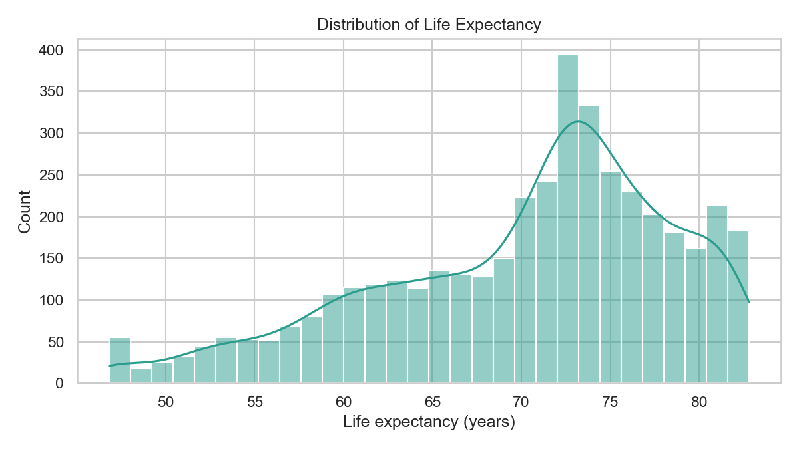
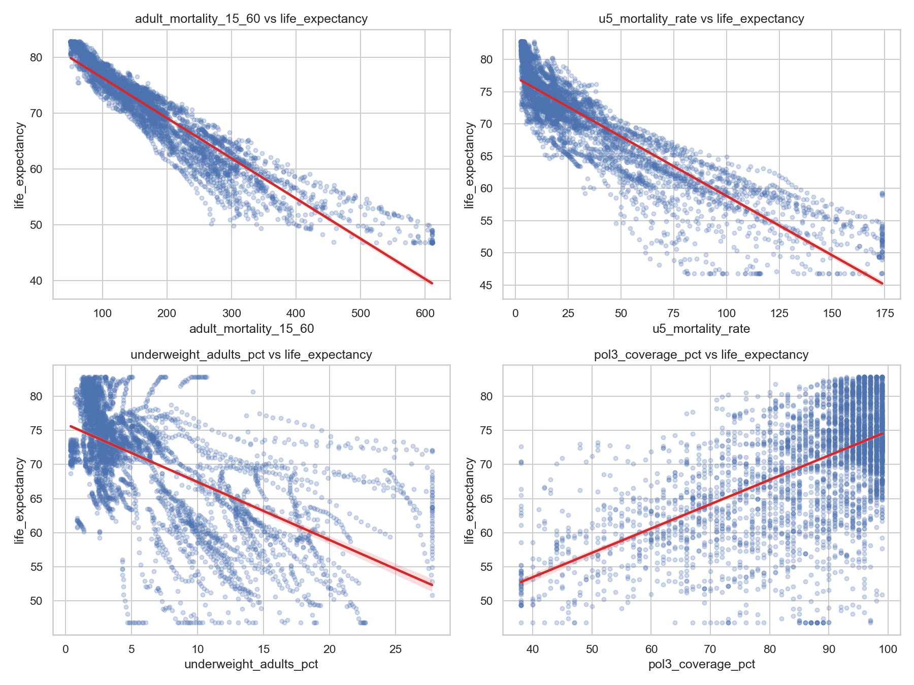

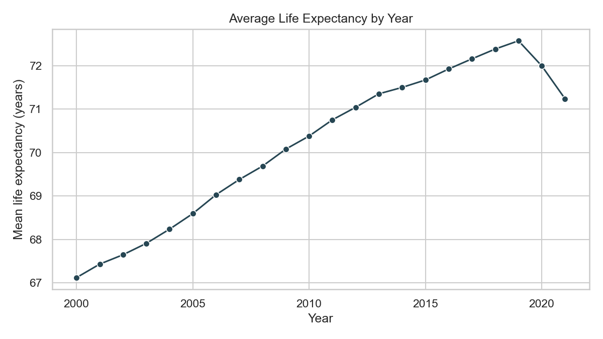

### Modeling and Diagnostics
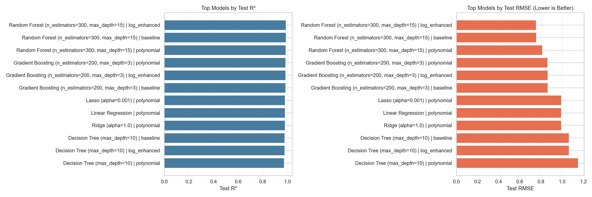
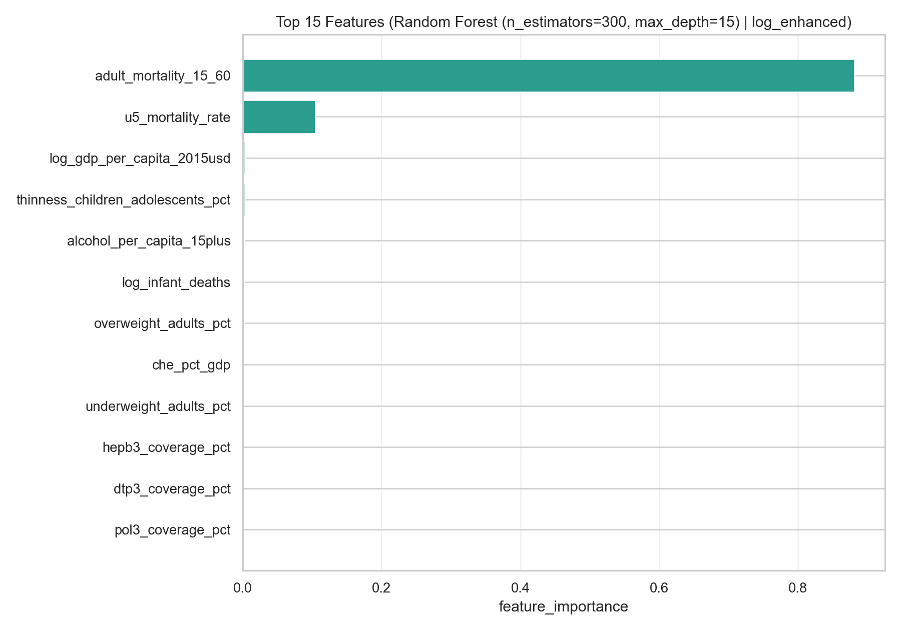
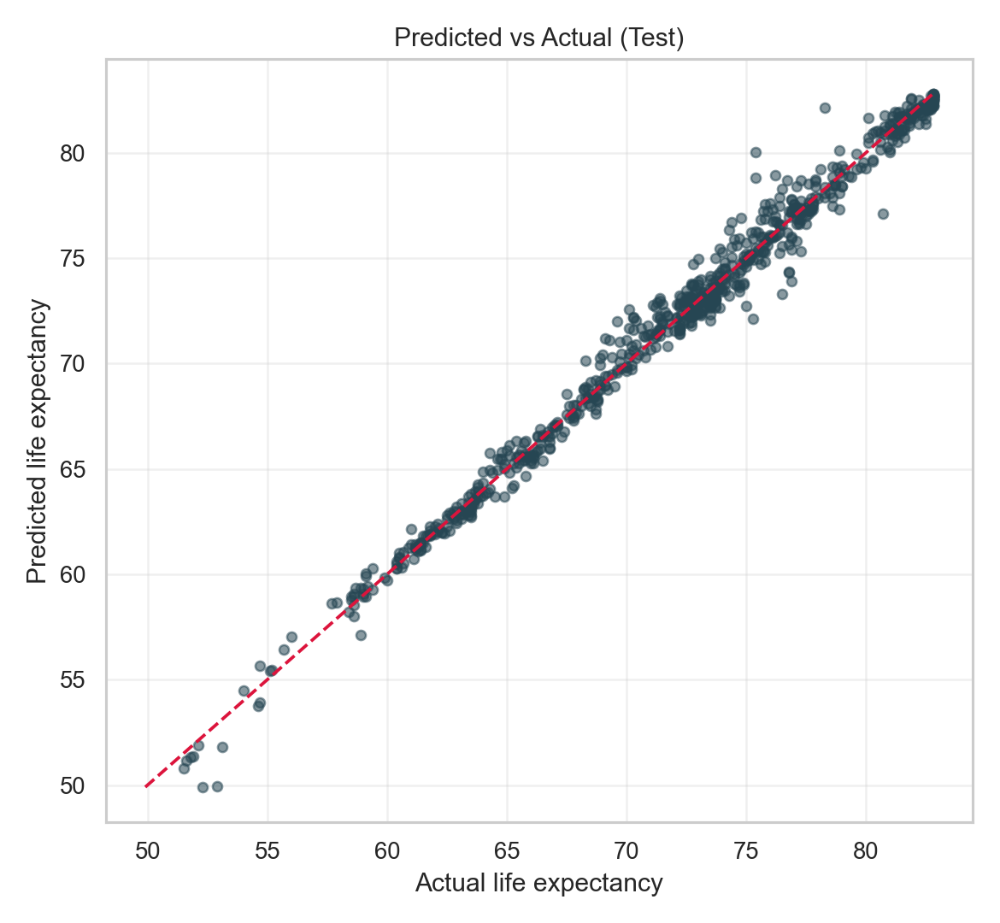
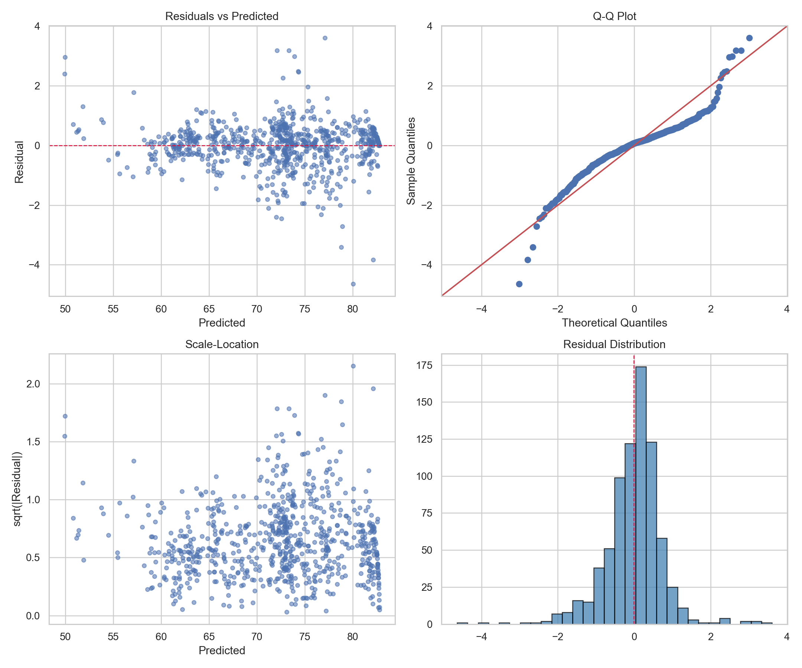
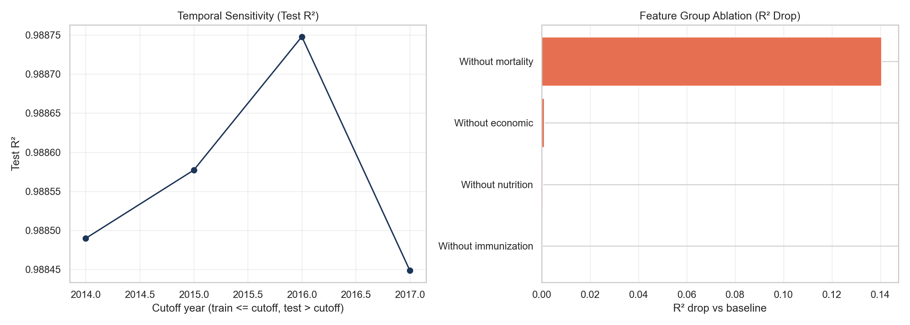

### Final Notebook Summary
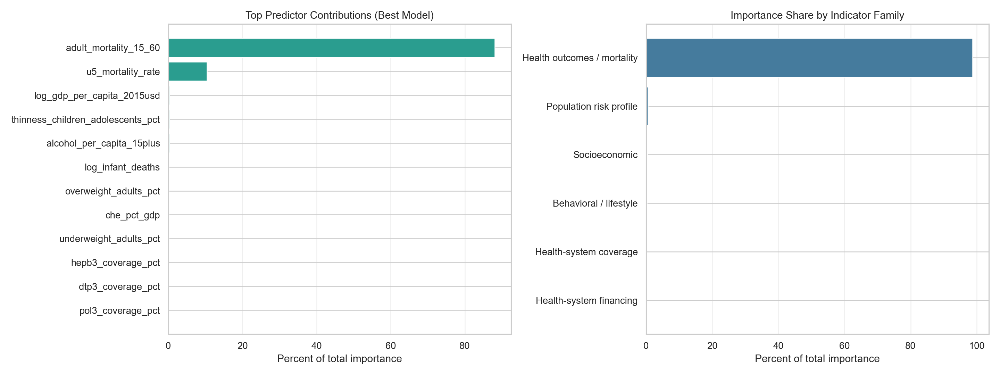
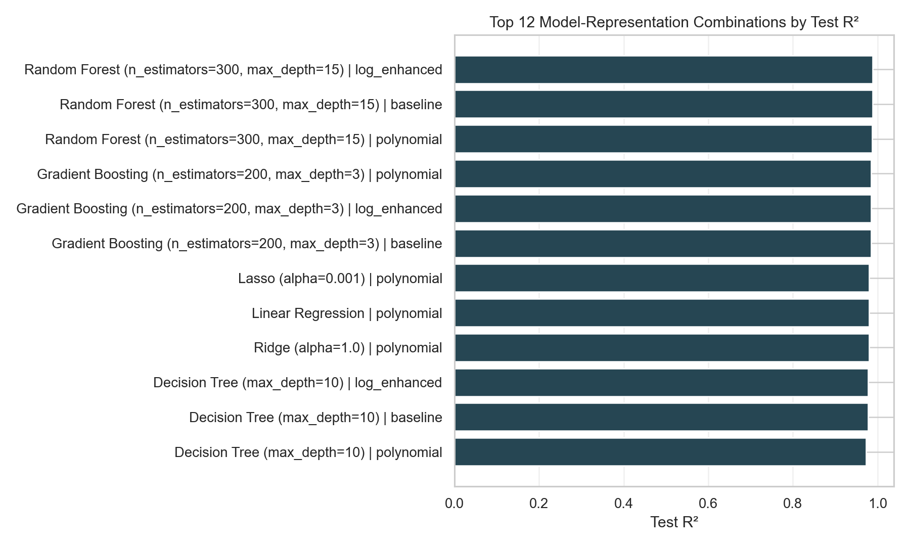


### Projection Outputs
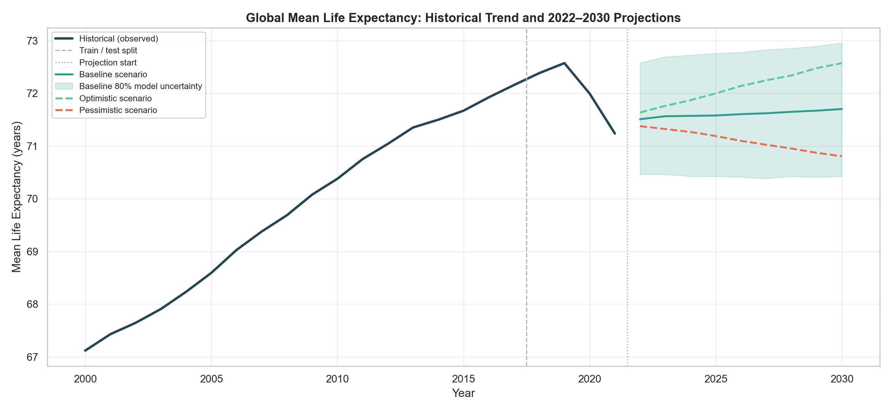
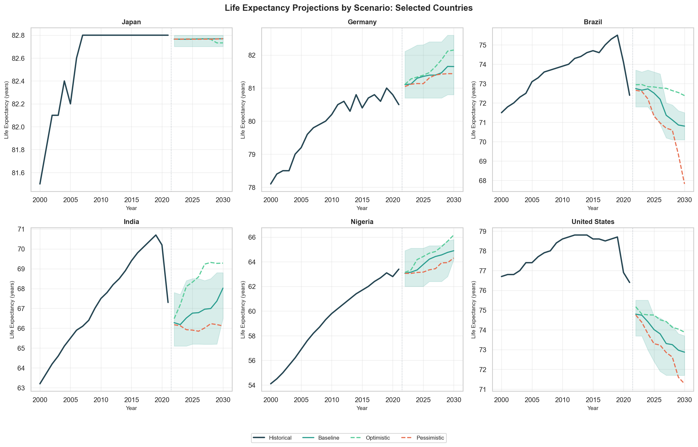
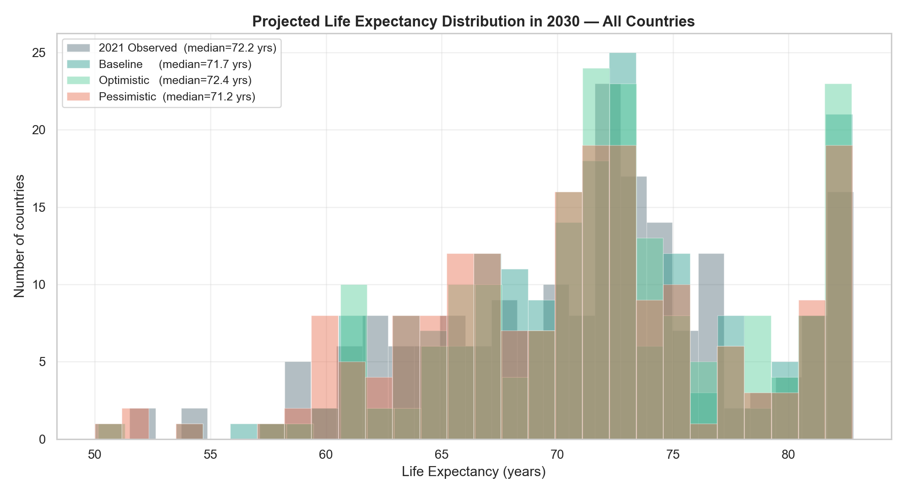
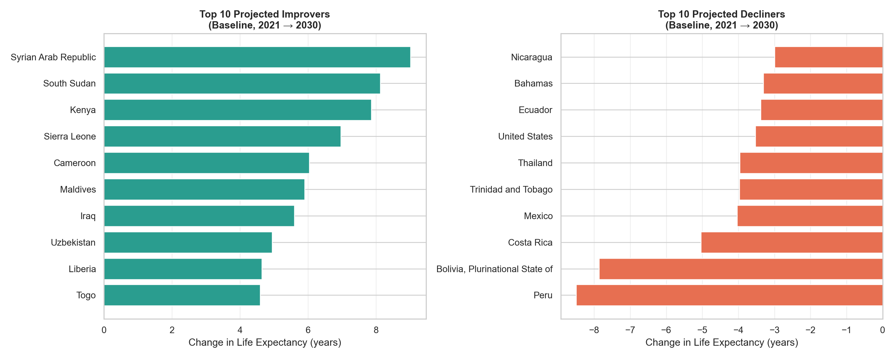

## 12) Repository Structure

```text
STATS201/
  Assets/
    full_data/
    cleaner_exports/
  Codes/
    export.ipynb
    data_cleaning.ipynb
    exploratory_analysis.ipynb
    train_models.ipynb
    project_final.ipynb
    projection.ipynb
    non_mortality.ipynb
    disease_and_conflict.ipynb
  Images/
  README.md
```

## 13) Main Exported Files
- Data panels:
  - `Assets/cleaner_exports/health_panel_2000_2021.csv`
  - `Assets/cleaner_exports/health_panel_ml_clean.csv`
  - `Assets/cleaner_exports/health_panel_ml_numeric.csv`
- Split files:
  - `Assets/cleaner_exports/train_temporal_2000_2017.csv`
  - `Assets/cleaner_exports/test_temporal_2018_2021.csv`
- Modeling outputs:
  - `Assets/cleaner_exports/model_comparison_temporal.csv`
  - `Assets/cleaner_exports/feature_importance_analysis_temporal.csv`
  - `Assets/cleaner_exports/robustness_checks_temporal.csv`
  - `Assets/cleaner_exports/residual_diagnostics_summary_temporal.csv`
  - `Assets/cleaner_exports/final_model_temporal.joblib`
- Projection outputs:
  - `Assets/cleaner_exports/projection_baseline_2022_2030.csv`
  - `Assets/cleaner_exports/projection_scenarios_2030.csv`
  - `Assets/cleaner_exports/projection_all_scenarios_2022_2030.csv`

## 14) Limitations
- Predictive analysis only; no causal identification.
- Country-year aggregates hide within-country heterogeneity.
- Extrapolation to 2030 assumes continuity of recent trends.
- Tree-level intervals do not capture full structural uncertainty.
