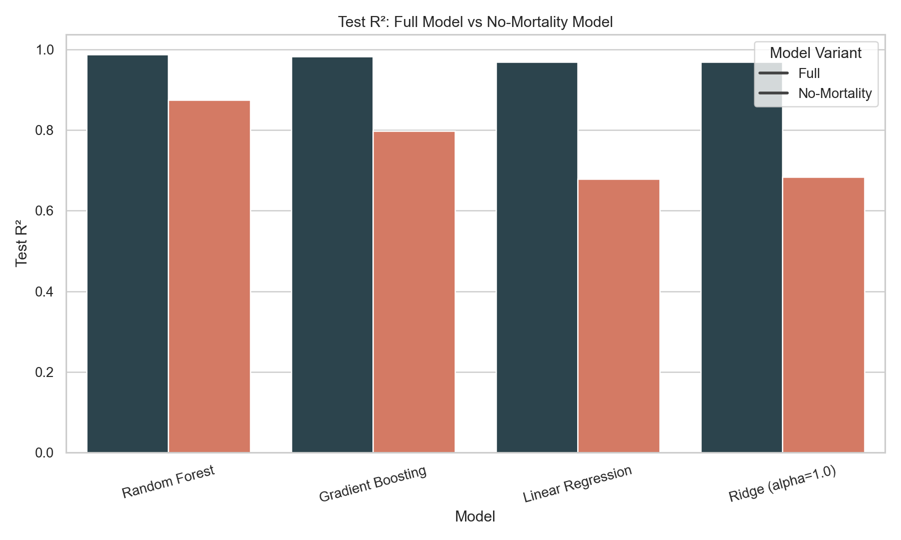
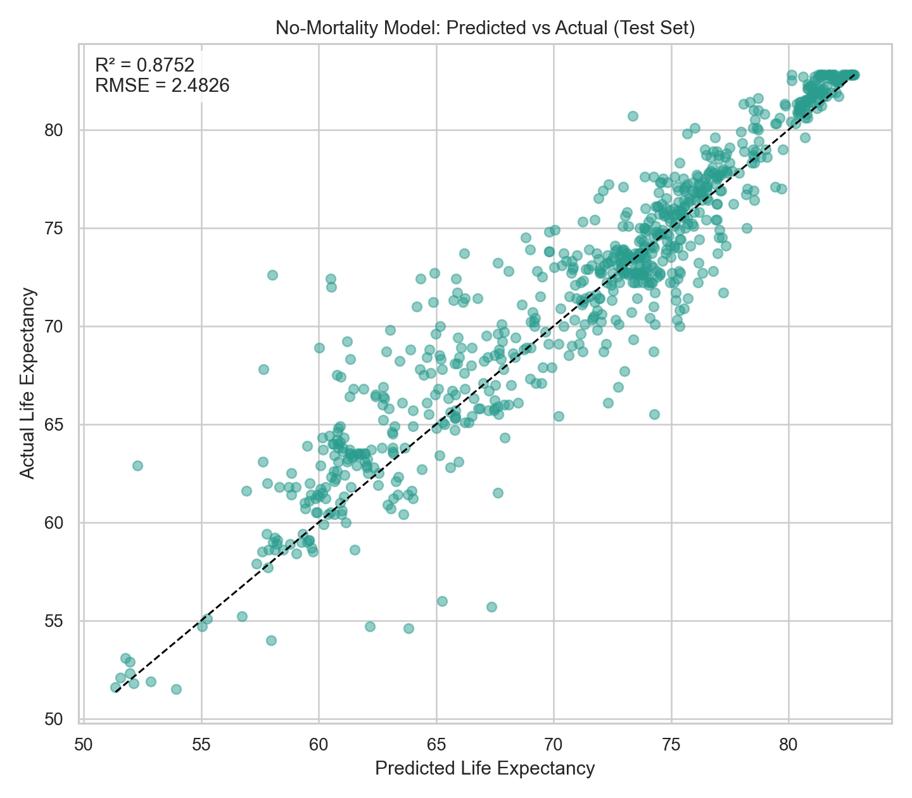
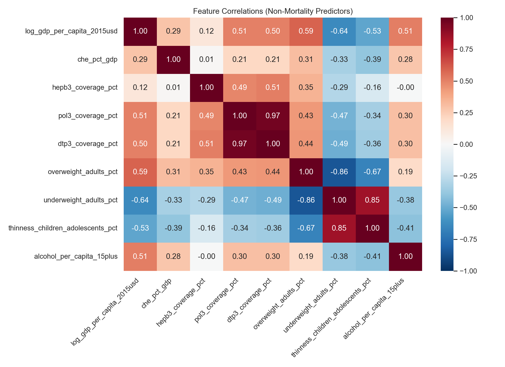
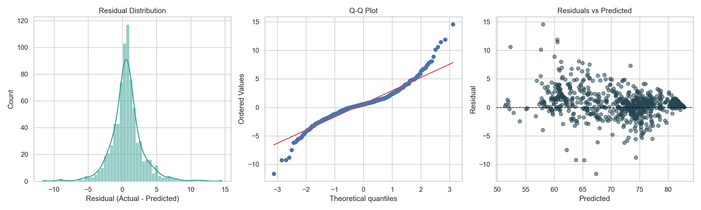
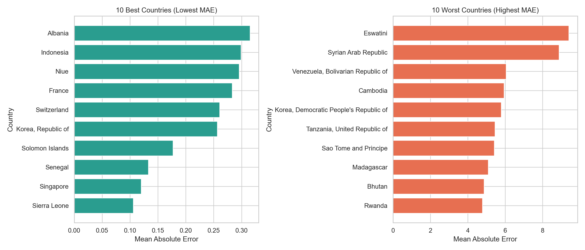

# Predicting National Life Expectancy

**Author:** Bikalpa Panthi  
**Course:** STATS 201 — Introduction to Machine Learning for Social Science  
**Term:** Spring 2025

---

## 📄 Project Report

👉 **[View the Full Report on GitHub Pages](https://github.com/3028Bikalpa/STATS201_project_Bikki)**

---

## Project Summary

This project uses machine learning to predict national life expectancy from socioeconomic and health-system indicators, using panel data from the **WHO Global Health Observatory** covering **192 countries** across **22 years** (2000–2021).

Seven regression models are compared across three feature representations (baseline, log-enhanced, polynomial) to answer: **Which indicators most strongly predict life expectancy, and how do different modeling strategies affect performance?**

### Key Findings

- **Random Forest with log-enhanced features achieves R² = 0.988** (RMSE = 0.754 years) on the temporal holdout test set (2018–2021).
- **Mortality indicators dominate prediction** — adult mortality alone accounts for the vast majority of the Random Forest's predictive signal.
- **When mortality is removed**, GDP × health expenditure interactions become the top predictor, and the model still achieves **R² = 0.875** (RMSE = 2.48 years).
- **Conflict/pandemic shock proxies** add little incremental predictive power in this setup.


---

## Research Question

> Which socioeconomic and health-system indicators most strongly predict national life expectancy, and how do different modeling strategies affect predictive performance?

### Why It Matters

A **30+ year gap** separates the highest and lowest national life expectancies globally. Understanding which factors drive this gap can inform health policy, resource allocation, and development priorities.


---

## Data

- **Source:** [WHO Global Health Observatory](https://www.who.int/data/gho)
- **Countries:** 192 · **Years:** 22 (2000–2021)
- **Unit of analysis:** Country × Year
- **Target:** Life expectancy at birth (both sexes)
- **Split:** Temporal holdout — Train: 2000–2017, Test: 2018–2021

### Finalized Variables

| Category | Variables |
|----------|-----------|
| **Mortality** | adult_mortality_15_60, u5_mortality_rate, infant_deaths |
| **Immunization** | hepb3_coverage_pct, pol3_coverage_pct, dtp3_coverage_pct |
| **Economic** | gdp_per_capita_2015usd, che_pct_gdp |
| **Population Risk** | overweight_adults_pct, underweight_adults_pct, thinness_children_adolescents_pct |
| **Behavioral** | alcohol_per_capita_15plus |


---

## Methods

### Models Tested

| Model | Key Parameters |
|-------|---------------|
| Dummy Regressor | mean baseline |
| Linear Regression | — |
| Ridge | α = 0.01 |
| Lasso | α = 0.001 |
| Decision Tree | max_depth = 10 |
| Random Forest | 300 trees, max_depth = 15 |
| Gradient Boosting | 200 trees, max_depth = 3 |

### Feature Representations

- **Baseline:** 12 raw features
- **Log-enhanced:** log-transform skewed variables (GDP, infant deaths)
- **Polynomial:** Degree-2 interactions and squared terms

---

## Results

### Full Model (with mortality variables)

| Rank | Model | Features | Test R² | RMSE |
|------|-------|----------|---------|------|
| 1 | Random Forest | log_enhanced | 0.988 | 0.754 |
| 2 | Random Forest | baseline | 0.988 | 0.755 |
| 3 | Random Forest | polynomial | 0.987 | 0.813 |
| 4 | Gradient Boosting | polynomial | 0.985 | 0.863 |
| 5 | Gradient Boosting | log_enhanced | 0.985 | 0.865 |


### Feature Importance

Adult mortality dominates — raising the question of whether the model is learning a near-tautological mapping.


### Without Mortality Variables

Removing mortality indicators forces the model to rely on actionable socioeconomic variables:

| Rank | Model | Features | Test R² | RMSE |
|------|-------|----------|---------|------|
| 1 | Random Forest | polynomial | 0.875 | 2.483 |
| 2 | Random Forest | log_enhanced | 0.849 | 2.727 |
| 3 | Random Forest | baseline | 0.849 | 2.729 |

The top predictors shift to GDP × health expenditure interactions, immunization × GDP interactions, and nutritional status variables.







---

## Diagnostics and Robustness

### Residual Diagnostics




### Robustness Summary

- Temporal sensitivity analysis across different cutoff years shows stable performance
- Low R² gap (< 0.02) indicates minimal overfitting
- Model remains strong even with reduced training data


### Country-Level Errors (No-Mortality Model)



---

## Repository Structure

```
STATS201/
├── Assets/
│   └── cleaner_exports/             # Raw and cleaned data files
│       ├── health_panel_2000_2021.csv
│       ├── health_panel_ml_clean.csv
│       ├── health_panel_ml_numeric.csv
│       ├── train_temporal.csv
│       └── test_temporal.csv
├── Codes/
│   ├── export.ipynb                 # Data collection from WHO/World Bank sources
│   ├── data_cleaning.ipynb          # Cleaning, imputation, feature engineering
│   ├── exploratory_analysis.ipynb   # EDA, correlations, feasibility assessment
│   ├── train_models.ipynb           # Full model comparison (7 models × 3 representations)
│   ├── non_mortality.ipynb          # Analysis without mortality variables
│   ├── disease_and_conflict.ipynb   # Conflict/pandemic shock proxy analysis
│   ├── projection.ipynb             # Life expectancy projections to 2030
│   └── project_final.ipynb          # Final synthesis and reporting
├── Images/                          # All generated figures
├── .gitignore
└── README.md
```

---

## Reproducing Results

### Prerequisites

- Python 3.10+
- pip

### Step 1: Clone and set up environment

```bash
git clone https://github.com/bikalpa-panthi/STATS201.git
cd STATS201
python -m venv .venv
source .venv/bin/activate        # On Windows: .venv\Scripts\activate
pip install -r requirements.txt
```

### Step 2: Install dependencies

If `requirements.txt` is not present, install manually:

```bash
pip install pandas numpy scikit-learn matplotlib seaborn scipy joblib openpyxl pycountry jupyter
```

### Step 3: Run notebooks in order

| Order | Notebook | Purpose |
|-------|----------|---------|
| 1 | `Codes/export.ipynb` | Parse WHO Excel exports and World Bank CSV into panel dataset |
| 2 | `Codes/data_cleaning.ipynb` | Clean, impute, clip outliers, create log-transformed features |
| 3 | `Codes/exploratory_analysis.ipynb` | EDA, correlation analysis, temporal train-test split |
| 4 | `Codes/train_models.ipynb` | Train all 7 models × 3 feature sets, evaluate on test set |
| 5 | `Codes/non_mortality.ipynb` | Re-run analysis excluding mortality variables |
| 6 | `Codes/disease_and_conflict.ipynb` | Add conflict/pandemic proxies and evaluate |
| 7 | `Codes/projection.ipynb` | Project life expectancy to 2030 under multiple scenarios |
| 8 | `Codes/project_final.ipynb` | Final synthesis, summary figures, and reporting |

```bash
cd Codes
jupyter notebook
```

Run each notebook top-to-bottom in the order above. Notebook 1 requires raw WHO Excel files and World Bank CSV in `Assets/`. Subsequent notebooks read cleaned outputs from `Assets/cleaner_exports/`.

### Data Access

Raw data is sourced from:
- **WHO GHO:** https://www.who.int/data/gho (Excel exports for each indicator)

Place raw files in `Assets/` before running `export.ipynb`. The cleaned panel files in `Assets/cleaner_exports/` are included in the repository.

---

## References

- World Health Organization. *Global Health Observatory Data Repository.* https://www.who.int/data/gho

### AI Acknowledgment

AI was used in writing some of the codes along with helping to rephrase the language in the report. The major contribution of GenAI tool was in code enhancement, language rephrasing for reports (improving sentence structure and grammar), image decoration (enhancing the designs of the images that resulted as an output of the codes) and writing of code outside the scope of STATS 201 class at DKU.