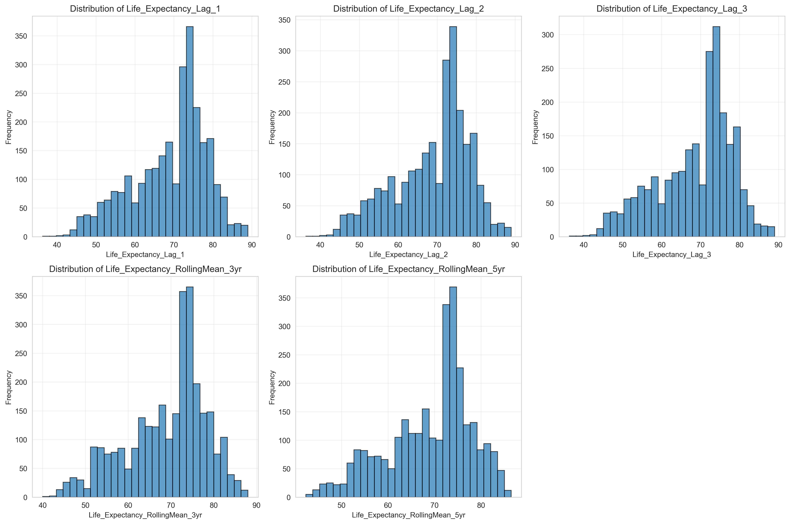
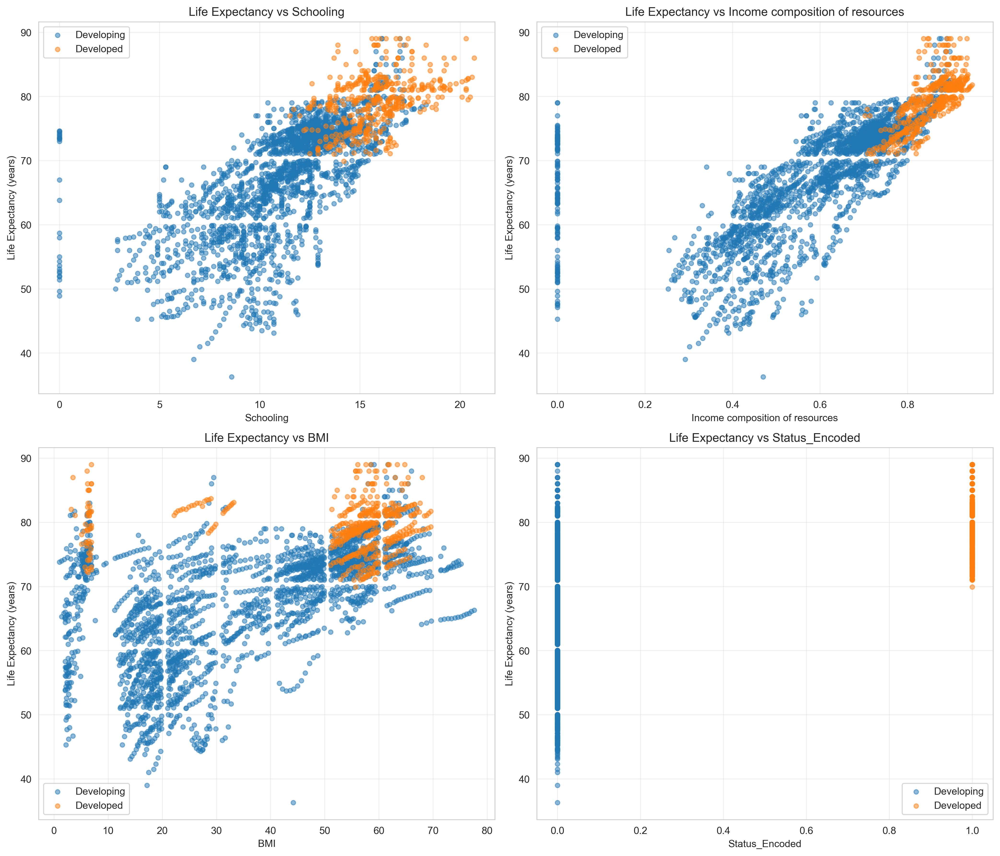

- [STATS 201 Course Project](#stats-201-course-project)
  - [Time Series Prediction of Life Expectancy (Data Cleaning ➜ Model Training)](#time-series-prediction-of-life-expectancy-data-cleaning--model-training)
  - [Author](#author)
  - [Course](#course)
  - [Project Overview](#project-overview)
  - [Research Question](#research-question)
  - [End-to-End Pipeline](#end-to-end-pipeline)
  - [Data Source](#data-source)
    - [Core Variables](#core-variables)
- [Notebook 1: `data_cleaning.ipynb`](#notebook-1-data_cleaningipynb)
  - [1. Import \& Load](#1-import--load)
  - [2. Initial Exploration](#2-initial-exploration)
  - [3. Missing Values](#3-missing-values)
  - [4. Cleaning Steps](#4-cleaning-steps)
    - [Remove Missing Target](#remove-missing-target)
    - [Missing Predictors (Deferred Imputation)](#missing-predictors-deferred-imputation)
    - [Duplicates (Country-Year)](#duplicates-country-year)
    - [Target Outliers (IQR)](#target-outliers-iqr)
    - [Encode Development Status](#encode-development-status)
    - [Time Series Features](#time-series-features)
    - [Missing Values from Lags](#missing-values-from-lags)
  - [5. Exploratory Data Analysis (EDA)](#5-exploratory-data-analysis-eda)
    - [Target Analysis](#target-analysis)
    - [Correlations](#correlations)
    - [Distributions](#distributions)
    - [Scatter Plots (Top Correlated Features)](#scatter-plots-top-correlated-features)
  - [6. Final Dataset and Export](#6-final-dataset-and-export)
- [Notebook 2: `train_models.ipynb`](#notebook-2-train_modelsipynb)
  - [1. Import \& Load Clean Data](#1-import--load-clean-data)
  - [2. Feature Selection and Data Preparation](#2-feature-selection-and-data-preparation)
  - [3. Train-Test Split (Temporal)](#3-train-test-split-temporal)
  - [4. Feature Scaling](#4-feature-scaling)
  - [5. Week 3 Baseline Models](#5-week-3-baseline-models)
    - [Model 1: DummyRegressor](#model-1-dummyregressor)
    - [Model 2: Linear Regression](#model-2-linear-regression)
    - [Model 3: Decision Tree Regressor](#model-3-decision-tree-regressor)
    - [Baseline Model Comparison](#baseline-model-comparison)
  - [6. Week 4: Feature Engineering + More Models](#6-week-4-feature-engineering--more-models)
    - [Feature Sets](#feature-sets)
    - [Models Trained](#models-trained)
    - [Comprehensive Comparison](#comprehensive-comparison)
    - [Residual Diagnostics](#residual-diagnostics)
    - [Feature Importance Comparison](#feature-importance-comparison)
  - [7. Outputs Saved](#7-outputs-saved)

# STATS 201 Course Project  
## Time Series Prediction of Life Expectancy (Data Cleaning ➜ Model Training)

## Author
**Bikalpa Panthi**

## Course
STATS 201

---

## Project Overview

This project builds a **time series regression pipeline** to predict **country-year life expectancy** using the Life Expectancy dataset.  
The workflow is intentionally split into **two notebooks**:

1. **`data_cleaning.ipynb`** — loads the raw dataset, cleans it, creates time-series-safe features (lags/rolling means), and exports a cleaned dataset.
2. **`train_models.ipynb`** — loads the cleaned dataset, performs a **temporal train-test split**, trains baseline + extended models, evaluates performance, and saves results/figures.

---

## Research Question

> **How accurately can we predict life expectancy over time using country-level health/economic indicators while respecting time ordering (no future leakage)?**

---

---

## End-to-End Pipeline

**Pipeline logic:**

1. **Raw CSV** (`Assets/Life Expectancy Data.csv`)  
2. **`data_cleaning.ipynb`**
   - Removes rows missing the target (`Life expectancy`)
   - Removes duplicate `(Country, Year)` rows
   - Adds time series features (lags, rolling means, YoY change)
   - Saves **clean dataset** (`clean_dataset.csv`)
   - Produces EDA & data quality plots in `images/`
3. **`train_models.ipynb`**
   - Loads `clean_dataset.csv`
   - Uses a **temporal split** (train = earlier years, test = later years)
   - Scales features
   - Trains and evaluates:
     - Week 3 baselines (Dummy / Linear Regression / Decision Tree)
     - Week 4 expanded models (Random Forest / Gradient Boosting / Ridge / Lasso)
   - Saves evaluation tables and plots

---

## Data Source

- **Dataset:** Life Expectancy Data (country-year panel)

### Core Variables
The dataset includes:
- `Country`, `Year` (panel/time keys)
- `Status` (Developed vs Developing)
- `Life expectancy` (target)
- Multiple health/economic predictors (e.g., mortality, immunization, GDP, schooling, etc.)

---

# Notebook 1: `data_cleaning.ipynb`

## 1. Import & Load

**Input:**
- Raw file: `Assets/Life Expectancy Data.csv`

---

## 2. Initial Exploration

This section checks:
- dataset shape
- first rows
- basic distributions / sanity checks

---

## 3. Missing Values

The notebook summarizes missingness by feature and visualizes missing value percentages.

---

## 4. Cleaning Steps

### Remove Missing Target
Rows with missing target are dropped:

- `df_clean = df_clean.dropna(subset=['Life expectancy'])`

**Why:** supervised learning requires a known target during training/evaluation.

---

### Missing Predictors (Deferred Imputation)

This notebook intentionally **does not impute** missing predictors yet:

- “Imputation is deferred to model training to avoid leakage across time.”

**Why this matters for time series:**  
If you impute using information from later years, you can leak future information into earlier years.

---

### Duplicates (Country-Year)

Duplicates are detected using:
- `df_clean.duplicated(subset=['Country', 'Year'], keep=False)`

Then removed by keeping the first occurrence per `(Country, Year)`.

---

### Target Outliers (IQR)

The notebook computes outlier bounds using a conservative IQR rule:
- bounds = `Q1 - 3*IQR` to `Q3 + 3*IQR`

It reports potential outliers (but does not necessarily drop them unless you extend the notebook).

---

### Encode Development Status

Creates:
- `Status_Encoded = 1` if Developed else `0`

This preserves the original `Status` column and adds a model-friendly numeric feature.

---

### Time Series Features

To support time-series prediction, the notebook sorts by:
- `Country`, then `Year`

Then creates **past-only** features:

1. `Years_Since_2000 = Year - 2000`
2. Lagged target features per country:
   - `Life_Expectancy_Lag_1`, `Life_Expectancy_Lag_2`, `Life_Expectancy_Lag_3`
3. Rolling means (past-only):
   - `Life_Expectancy_RollingMean_3yr`, `Life_Expectancy_RollingMean_5yr`  
   (computed on `shift(1)` so the current year never uses itself)
4. Year-over-year change (past-only):
   - `Life_Expectancy_YoY_Change` using `diff().shift(1)`

**Key principle:** feature engineering uses `.shift(...)` to avoid using the current year’s target when creating predictors.

---

### Missing Values from Lags

Lag features naturally introduce missingness in early years (e.g., first year has no lag-1).  
The notebook prints missing counts and explicitly states imputation happens in modeling.

---

## 5. Exploratory Data Analysis (EDA)

### Target Analysis

Produces status-based life expectancy comparisons and trends over time.

---

### Correlations

Computes correlation between numeric predictors and target, then visualizes a correlation matrix of top features.

---

### Distributions

Plots histograms of the most correlated features.

---

### Scatter Plots (Top Correlated Features)

Plots life expectancy vs the top positively correlated predictors, split by `Status`.

---

## 6. Final Dataset and Export

**Output:**
- `clean_dataset.csv`

---

# Notebook 2: `train_models.ipynb`

## 1. Import & Load Clean Data

**Input:**
- `clean_dataset.csv` produced by `data_cleaning.ipynb`

---

## 2. Feature Selection and Data Preparation

This section defines:
- target: `Life expectancy`
- predictors: numeric features + engineered features (depending on feature set)
- handles data types
- prepares train/test matrices

---

## 3. Train-Test Split (Temporal)

This notebook uses a **time-respecting split** rather than random splitting.

**Goal:** train on earlier years, test on later years.

---

## 4. Feature Scaling

Uses `StandardScaler` fit on training data and applied to test data.

**Why:** many regression models benefit from standardized feature scales, and scaling must be fit only on training to avoid leakage.

---

## 5. Week 3 Baseline Models

All models are evaluated using standard regression metrics:
- RMSE (root mean squared error)
- MAE (mean absolute error)
- R²

### Model 1: DummyRegressor
**Purpose:** establishes a minimal performance baseline.

---

### Model 2: Linear Regression
Trains a linear baseline and visualizes coefficient magnitudes.

---

### Model 3: Decision Tree Regressor
Trains a non-linear baseline and visualizes feature importances.

---

### Baseline Model Comparison

The notebook produces model comparison plots and exports baseline results.

**Saved table:**
- `baseline_model_results.csv`

---

## 6. Week 4: Feature Engineering + More Models

### Feature Sets

The notebook defines three feature sets for controlled comparison:

1. **Baseline Features** (Week 3 originals)
2. **Polynomial Features** (quadratic terms for key predictors)
3. **Engineered Features** (domain-specific combinations)

---

### Models Trained

The Week 4 notebook trains and compares:
- **Random Forest Regressor**
- **Gradient Boosting Regressor**
- **Ridge Regression**
- **Lasso Regression**

---

### Comprehensive Comparison

The notebook generates an overall comparison plot/table across models and feature sets.

---

### Residual Diagnostics

Residual distributions are created for error-shape inspection.

---

### Feature Importance Comparison

Feature importance/coefficients are extracted for:
- Random Forest + Gradient Boosting (`feature_importances_`)
- Ridge + Lasso (`|coef_|`)

---

## 7. Outputs Saved

Depending on which sections you run, the notebook writes:

**Tables**
- `baseline_model_results.csv`
- `week4_model_comparison.csv`
- `week4_feature_importance.csv`

**Figures**
- `train_test_distribution.png`
- `linear_regression_coefficients.png`
- `decision_tree_importances.png`
- `model_comparison.png`
- `prediction_analysis.png`
- `residual_analysis.png`
- `week4_comprehensive_comparison.png`
- `week4_model_predictions_comparison.png`
- `week4_residual_distributions.png`
- `week4_feature_importance_comparison.png`

---

